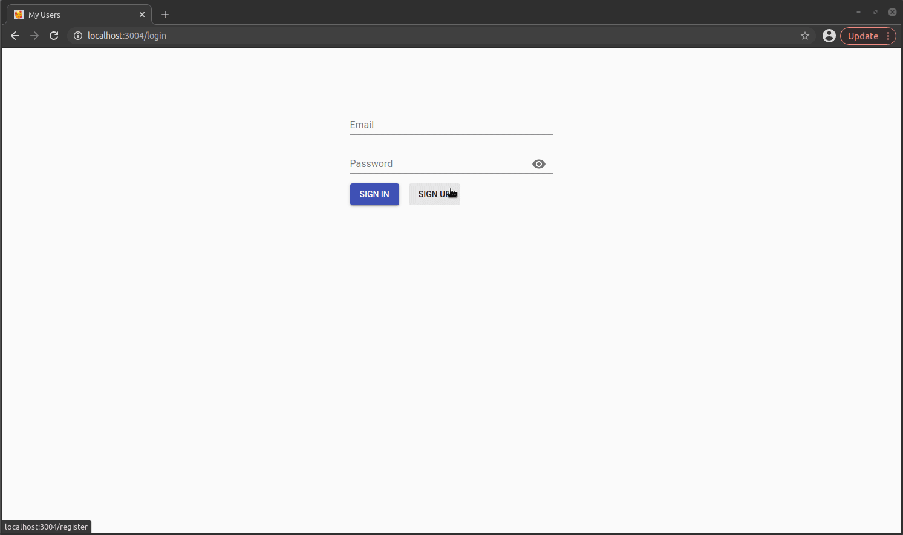

## 🥰 Projeto My users

<p align="center">
  
  
</p>

#### 🛠️ Libs Back
- Nodejs
  * Express
  * Nodemon 
  * Passport 
  * Jwt 
  * Bcrypt 
- MongoDB
  * Mongoose

#### 🖥️ Libs Front
- React
  * Redux 
- Axios 
- Local storage
- MaterialUI components

#### 🛠️ Backend features
Listagem, criação, atualização e delete de usuários

#### 🖥️ Frontend features
Login com autenticação por localstorage, atualização e deleção de profile, log out, e listagem de usuários


## Como iniciar a aplicação

#### 📝 Requerimentos

- Node.js
- NPM

### Instalando os pacotes

Após o projeto baixado ou clonado, entrar no diretório do projeto, e executar o comando abaixo para instalar as dependências:
``` bash
npm install
```

### Iniciando o Front e Back

Ainda dentro do diretório do projeto clonado, basta executar o comando abaixo, e pronto! :D
``` bash
npm start
```

A aplicação irá iniciar automaticamente no browser na Url `http://localhost:3004`

Aguarde a execução e a API estará rodando na Url  `http://localhost:8001/api/`

rodar na versão 14 do node, para evitar erros.

<br/>

<h4 align="center">
  ---

Made with ♥ by Arthur Lima :wave: [Get in touch!](https://www.linkedin.com/in/arthur-lima-294ab0103/)
</h4>


